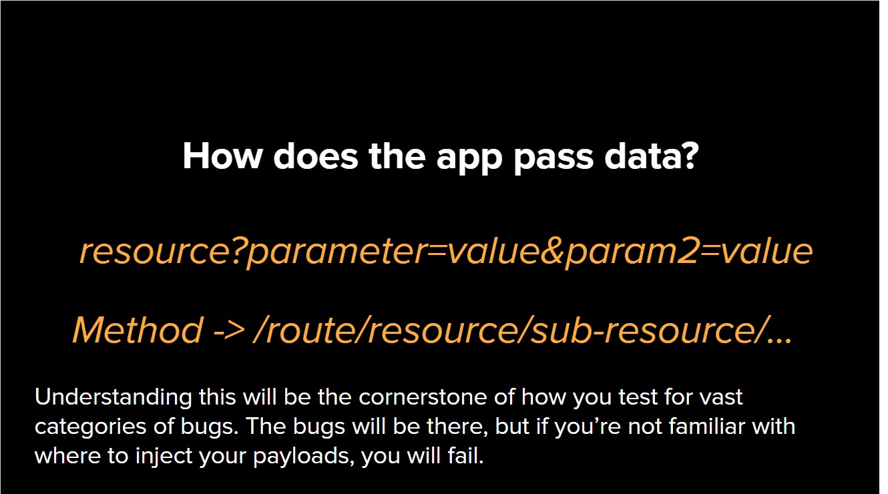
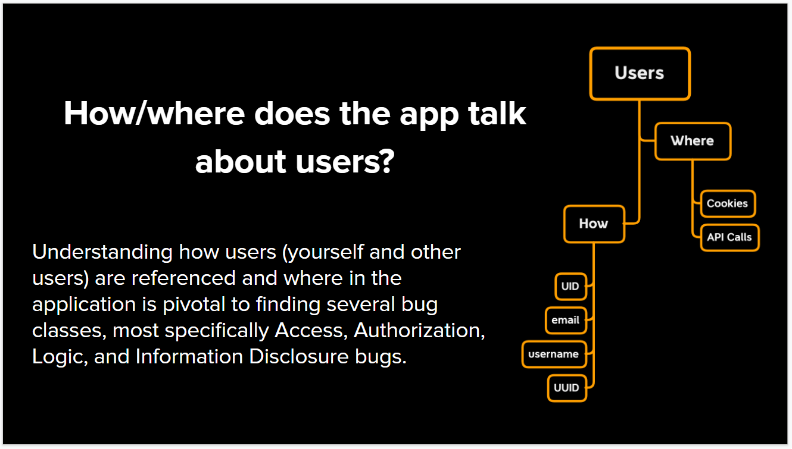
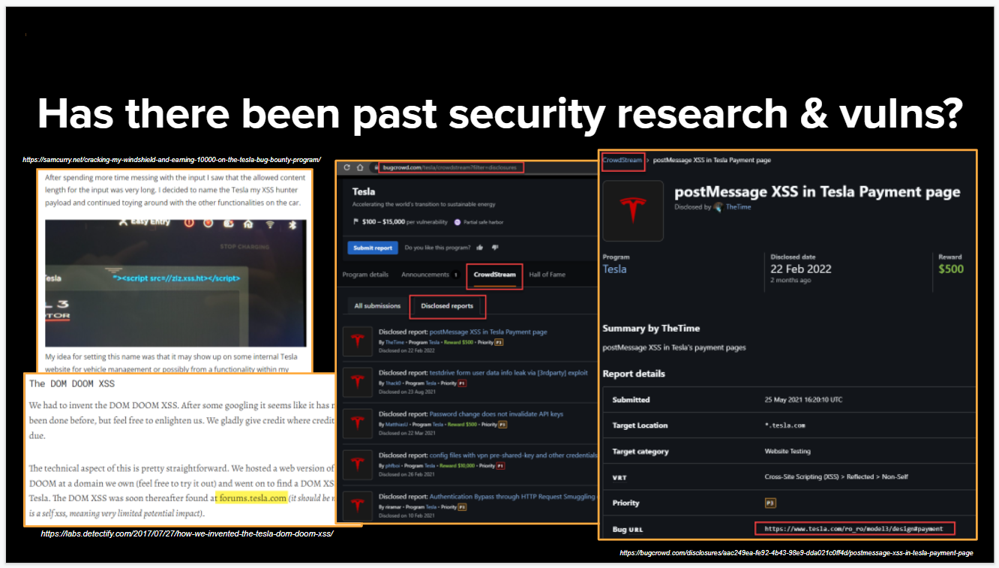
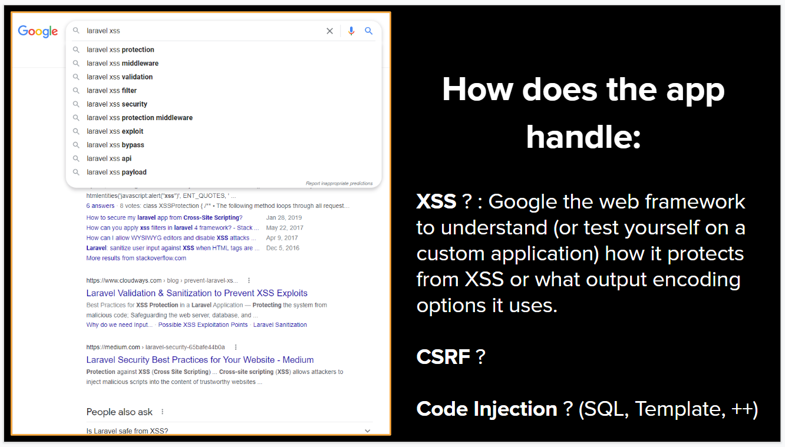

# 6 Questions that Guarantee your Bounty
&nbsp;

### 1. How does the app pass data?
parameter or path?

&nbsp;

### 2. How/Where does app Talk about users?
Cookie or API Calls?
uid or username or email or uuid?

&nbsp;

### 3. Does site have multiple user levels?
admin, user, viewer, etc...

&nbsp;

### 4. Has there been past vulns?

&nbsp;

### 5. How does the app handle?
XSS? CSRF? Code Injection?

&nbsp;

### 6. Does site have unique threat model?

&nbsp;

## Credit
Based on [Jhaddix](https://docs.google.com/presentation/d/1cMSRVlJJ5de6Pyv-09YgzOGS0OYrP6p7ggGl0f42wmw/edit#slide=id.g89b65a088d_0_8)'s peresentation
 &nbsp;

## Support
You can Follow [me](https://twitter.com/MeAsHacker_HNA) on twitter or buy me a [Coffee](https://buymeacoffee.com/NafisiAslH)
