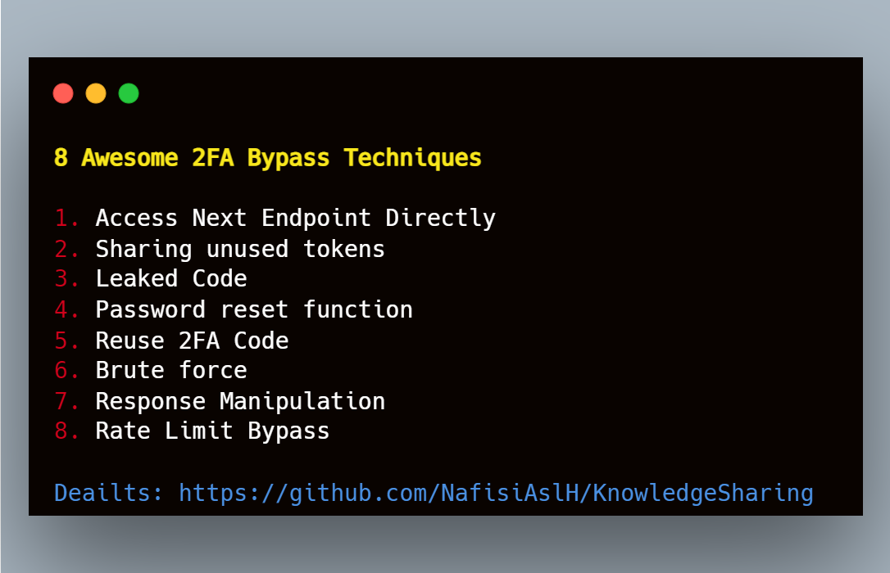

# 8 Awesome 2FA Bypass Techniques 🗝️
&nbsp;


### 1. Access Next Endpoint Directly
- Just try to access the next endpoint directly (you need to know the path of the next endpoint)
- If this doesn't work, try to change the Referrer header as if you came from the 2FA page.</br>
&nbsp;

### 2. Sharing unused tokens
- Check if you can get for your account a token and try to use it to bypass the 2FA in a different account.</br>
&nbsp;

### 3. Leaked Code
- Is the token leaked on a response from the web application?</br>
&nbsp;

### 4. Password reset function
- In almost all web applications the password reset function automatically logs the user into the application after the reset procedure is completed.</br>
&nbsp;

### 5. Reuse 2FA Code
- Also, try requesting multiple 2FA codes and see if previously requested Codes expire or not when a new code is requested</br>
&nbsp;

### 6. Brute force
- There is any limit in the amount of codes that you can try, so you can just brute force it.</br>
&nbsp;

### 7. Response Manipulation
- Change failed response to success response
- Change failed status code to success status code</br>
&nbsp;

### 8. Rate Limit Bypass
- Using Similar Endpoints: ``` /sign-up --> /Sign-up ```
- Blank char in params: ``` code=1234%0a ```
- Change Origin IP using header: ``` X-Forwarded-For: 127.0.0.1 ```
- Add extra params: ``` /resetpwd?someparam=1</br> ```
&nbsp;

## Credit
Based on [hacktricks](https://book.hacktricks.xyz/pentesting-web/2fa-bypass)'s web page.
Based on [hacktricks](https://book.hacktricks.xyz/pentesting-web/rate-limit-bypass)'s web page.
</br>&nbsp;

## Support
You can Follow [me](https://twitter.com/MeAsHacker_HNA) on twitter or buy me a [Coffee](https://buymeacoffee.com/NafisiAslH)
