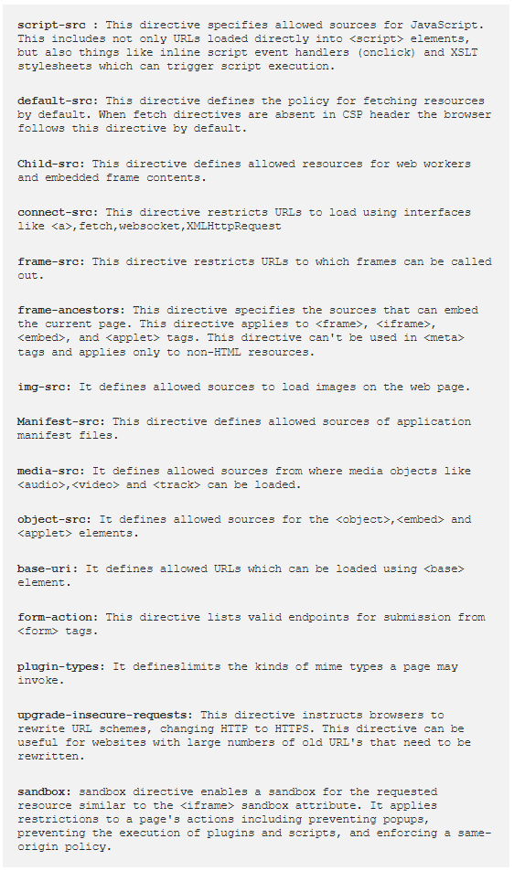
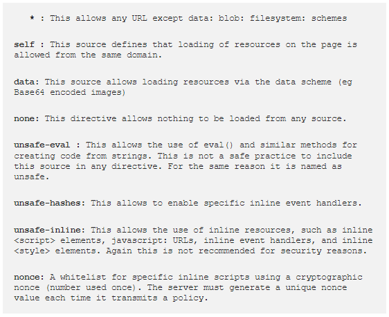
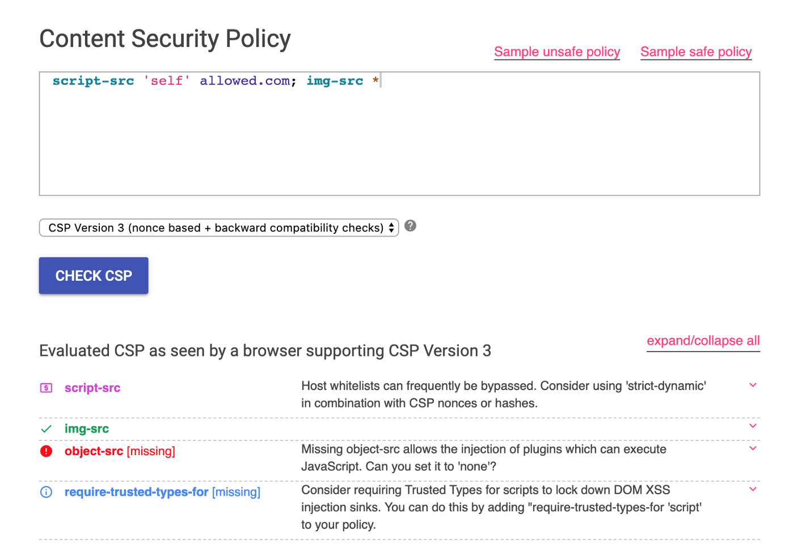

# Everything you need to know about CSP Header 🔬
&nbsp;

### What is a CSP ?
- CSP stands for Content Security Policy which is a mechanism to define which resources can be fetched out or executed by a web page.</br>
- In other words, it can be understood as a policy that decides which scripts, images, iframes can be called or executed on a particular page from different locations.
</br>&nbsp;

### Why it is used?
- Content Security Policy is widely used to secure web applications against content injection like cross-site scripting attacks.</br>
- Also by using CSP the server can specify which protocols are allowed to be used.
</br>&nbsp;

### How Does it work?
- CSP works by restricting the origins that active and passive content can be loaded from.</br>
- From there, it’s browser’s call to follow that policy and actively block violations as they are detected.
</br>&nbsp;

### Common CSP directives:

</br>&nbsp;

### Common CSP sources:

</br>&nbsp;

### An Example:
```
Content-Security-Policy: default-src 'self'; script-src https://bhaveshthakur.com; report-uri /Report-parsing-url;
```
- `````` --> This image will be allowed as image is loading from same domain i.e. bhaveshthakur.com
- ```<script src=script.js>``` --> This script will be allowed as the script is loading from the same domain i.e. bhaveshthakur.com
- ```<script src=https://evil.com/script.js>``` --> This script will not-allowed as the script is trying to load from undefined domain i.e. evil.com
- ```"/><script>alert(1337)</script>``` --> This will not-allowed on the page.
</br>&nbsp;

### Automatic Analysis
There are few online tools that are very helpful.</br>
- [withgoogle](https://csp-evaluator.withgoogle.com/)
- [cspvalidator](https://cspvalidator.org/)
- 
</br>&nbsp;

## Credit
Based on [Bhavesh Thakur](https://bhavesh-thakur.medium.com/content-security-policy-csp-bypass-techniques-e3fa475bfe5d)'s writeup.
</br>&nbsp;

## Support
You can Follow [me](https://twitter.com/MeAsHacker_HNA) on twitter or buy me a [Coffee](https://buymeacoffee.com/NafisiAslH)
