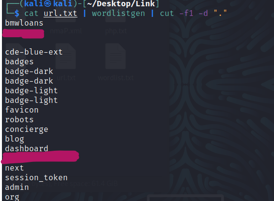
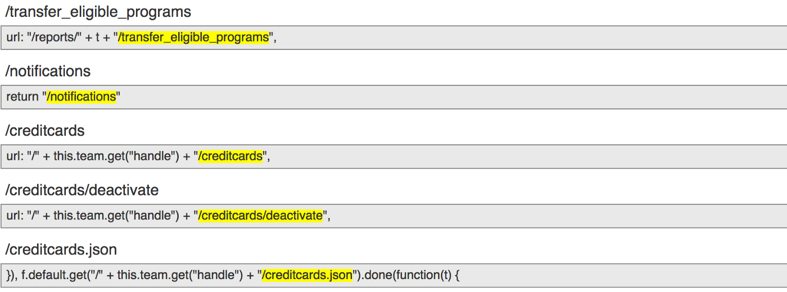
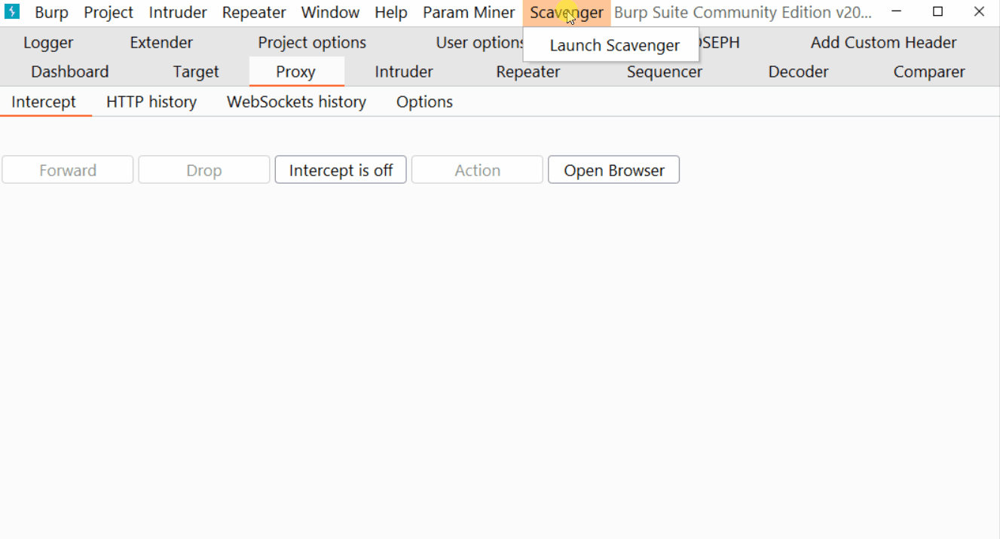

# More Efficient Fuzzing with Target Specific Wordlist ⚒️
&nbsp;


### 1. Using waybackurls and gau
[gau](https://github.com/lc/gau) and [waybackurls](https://github.com/tomnomnom/waybackurls) fetches known URLs
```
echo target.com | gau | waybackurls > urls.txt
cat urls.txt | wordlistgen | cut -f1 -d "." > wordlist.txt
```

</br>&nbsp;

### 2. Using javascript files
[LinkFinder](https://github.com/GerbenJavado/LinkFinder) is a python script written to discover endpoints and their parameters in JavaScript files.
```
$ linkfinder.py -i Target.com -d -o cli | wordlistgen > wordlist.txt
```


### 3. Using Burp Extension
[Scavenger](https://github.com/0xDexter0us/Scavenger) is a burp extension to create the wordlist from burp history which can be used for efficient fuzzing.



## Credit
Based on [vamshivaran110](https://medium.com/@vamshivaran110/fuzzing-with-custom-wordlists-bb7a808d943f)'s web page.
</br>&nbsp;

## Support
You can Follow [me](https://twitter.com/MeAsHacker_HNA) on twitter or buy me a [Coffee](https://buymeacoffee.com/NafisiAslH)
