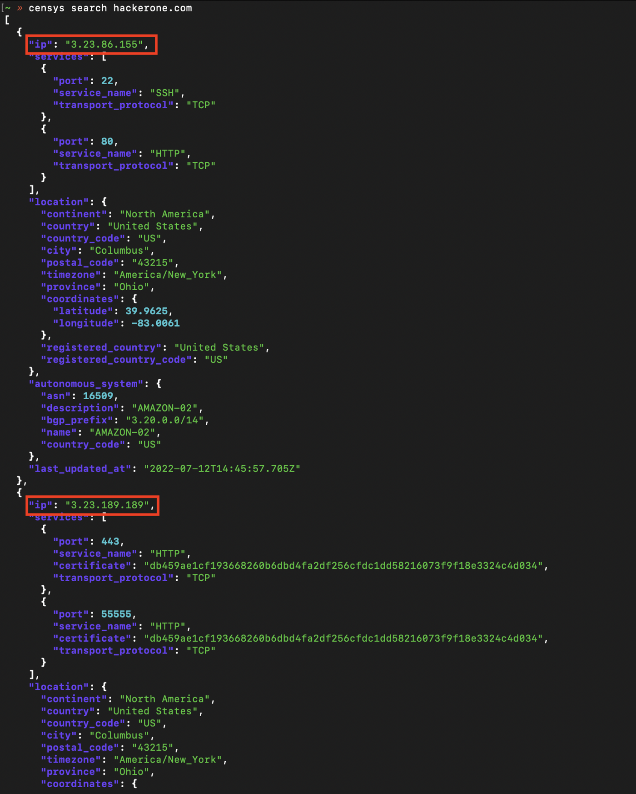
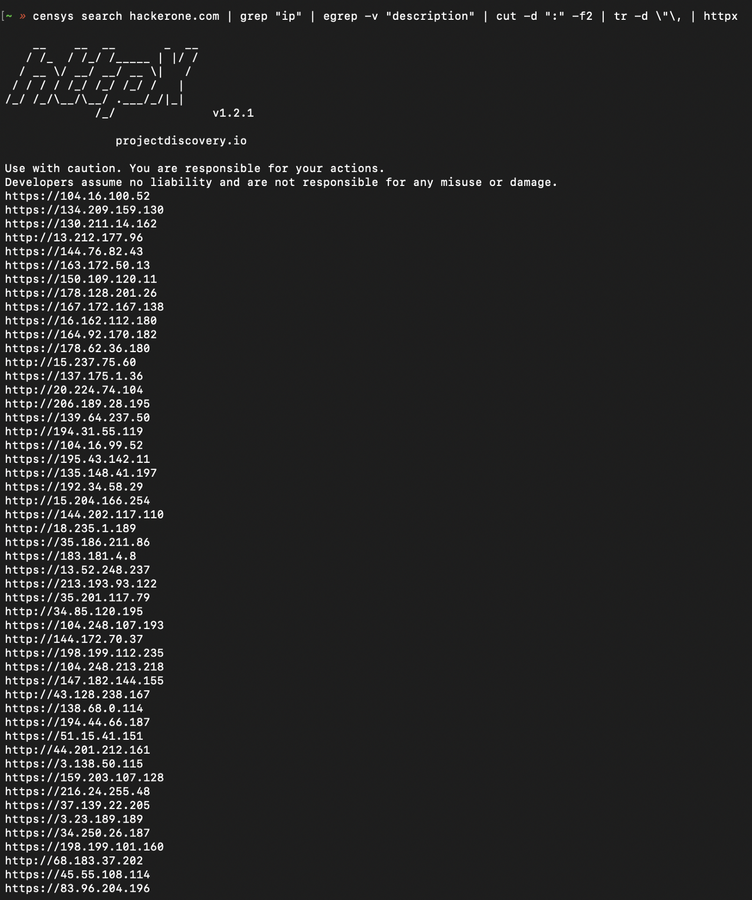
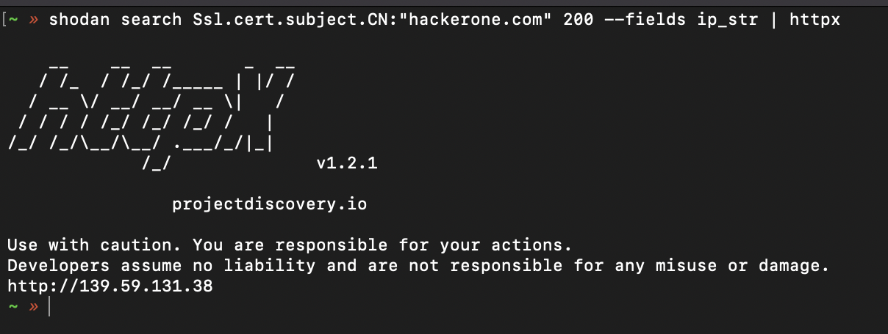
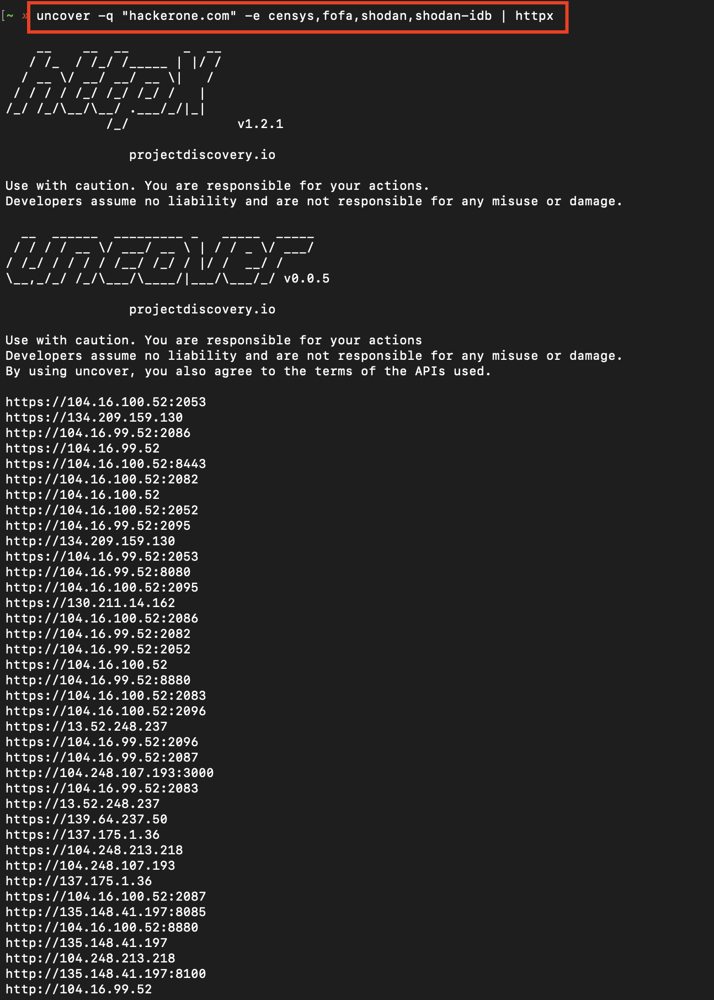
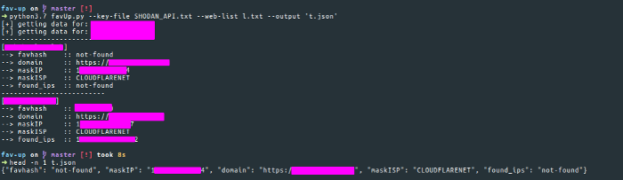
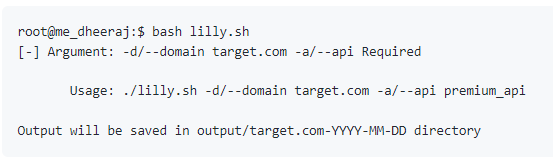
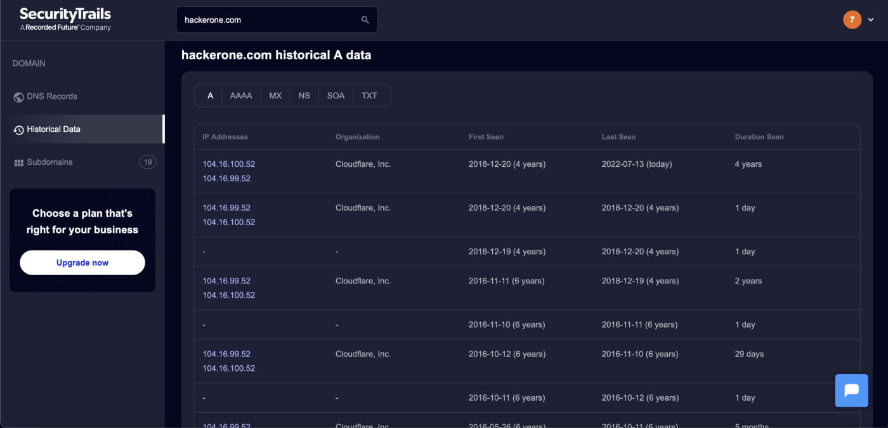
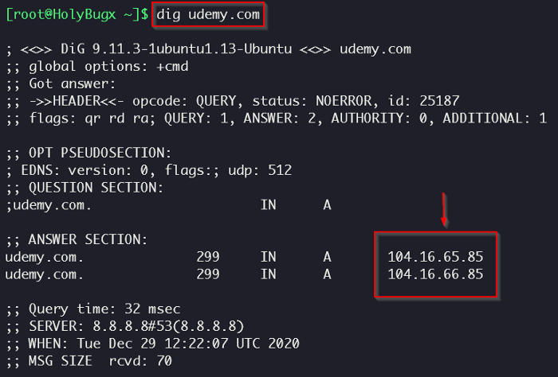

# How to find Origin IP Automatically 🔭
&nbsp;


### 1. Censys
```
censys search hackerone.com
censys search hackerone.com | grep “ip” | egrep -v “description” | cut -d “:” -f2 | tr -d \”\, | httpx
```


&nbsp;

### 2. Shodan
```
shodan search Ssl.cert.subject.CN:”hackerone.com” 200 — fields ip_str | httpx
```

&nbsp;

### 3. Uncover
- [uncover](https://github.com/projectdiscovery/uncover) is a go wrapper using APIs of well known search engines to quickly discover exposed hosts on the internet.
```
uncover -q “hackerone.com” -e censys,fofa,shodan,shodan-idb | httpx
```

&nbsp;

### 4. Favicon Hashes
- Python script for generating the hash
```
import mmh3
import requests
import codecs

response = requests.get('https://<website>/<favicon path>')
favicon = codecs.encode(response.content, 'base64')
hash = mmh3.hash(favicon)
print(hash)
```
- Using [Fav-Up](https://github.com/pielco11/fav-up) tool you can look up for real IP<br>
<br>
- Using [LiLi](https://github.com/Dheerajmadhukar/Lilly/blob/main/README.md) tool you can look up for real IP<br>
<br>
&nbsp;

### 5. SecurityTrails
- You can explore complete current and historical data for any internet assets.

&nbsp;

### 6. DNS Records
```
dig udemy.com A
dig udemy.com MX
```

&nbsp;

## Credit
Based on [பூபதி S.](https://medium.com/@bobby.S/how-to-find-origin-ip-1f684f459942)'s writeup
Based on [HolyBugx](https://infosecwriteups.com/finding-the-origin-ip-behind-cdns-37cd18d5275)'s writeup
</br>&nbsp;

## Support
You can Follow [me](https://twitter.com/MeAsHacker_HNA) on twitter or
<br><br><a href="https://www.buymeacoffee.com/NafisiAslH" target="_blank"></a>
