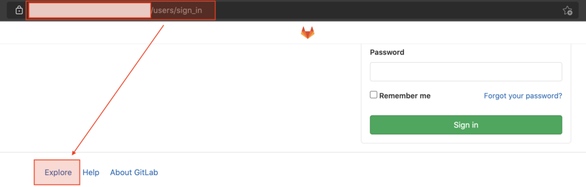
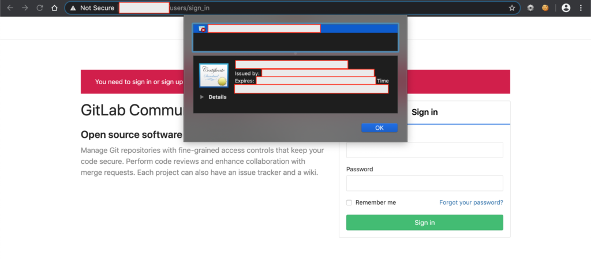
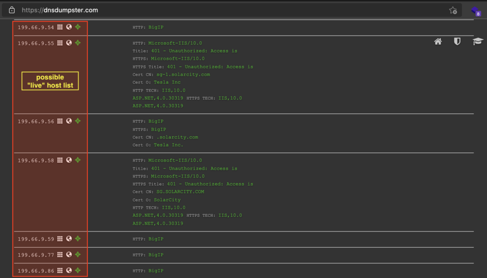
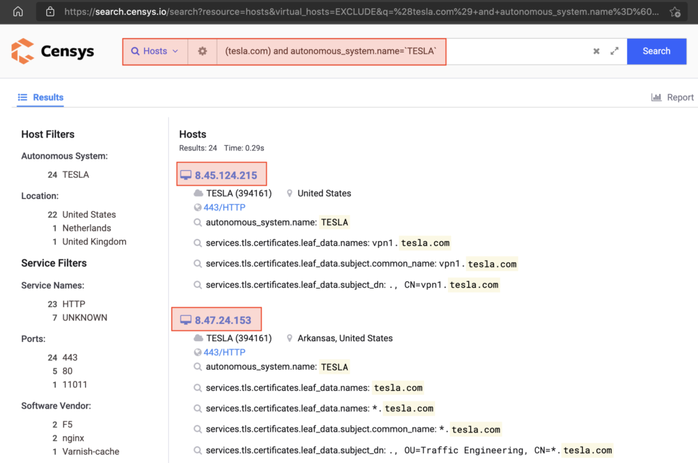
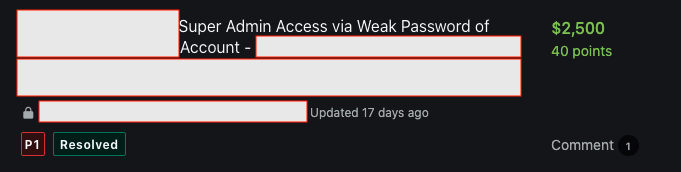

# From Recon to Getting P1 on TESLA 👻

### 1. Find out target servers IP
- Tools: Censys and dnsdumpster

 &nbsp;

### 2.Finding GetLab on One of the IPs

 &nbsp;

### 3. Misconfiguration on GitLab Target
- Any one had Access to explore in groups

 &nbsp;

### 4. Test Default Passwords on Found Username
- I found user allowed me to login with password: "password"
- I could manage so many projects in it.
- Program owner awarded a bounty worth P1 for this find.

 &nbsp;

## Credit
Based on [YoKo Kho](https://infosecwriteups.com/from-recon-via-censys-and-dnsdumpster-to-getting-p1-by-login-using-weak-password-password-504e617956ce)'s write-up.
 &nbsp;

## Support
You can Follow [me](https://twitter.com/MeAsHacker_HNA) on twitter or buy me a [Coffee](https://buymeacoffee.com/NafisiAslH)
