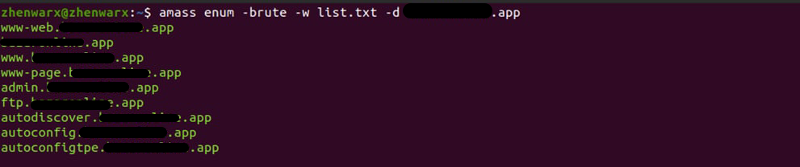
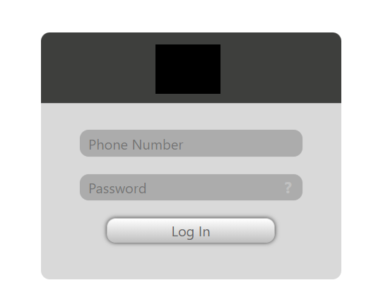
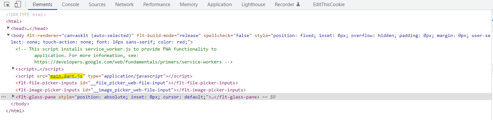
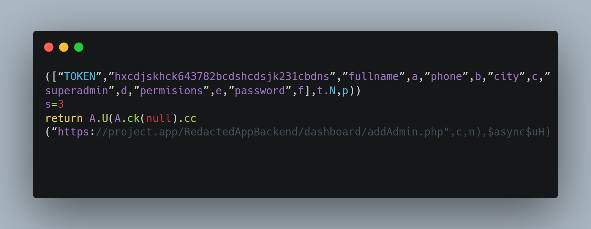
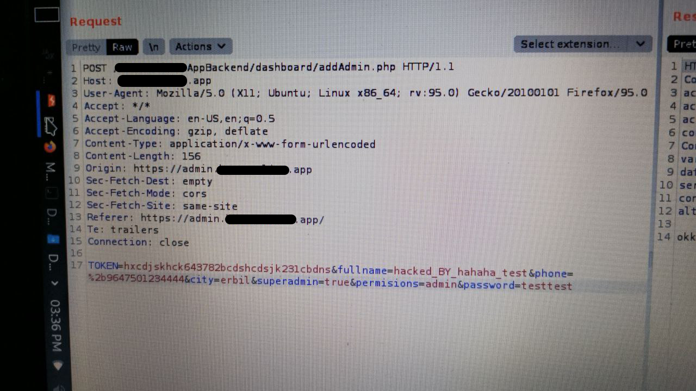

# How We hacked (bypassed) Admin Panel just by JS file:

### 1. Introduction
Team gave mobile app and website. 
We didn’t waste of time on mobile app and decided to work on website. 
We just tried to find Admin Panel because main domain was just a single page to download the app.
 &nbsp;

### 2. Subdomain Enumeration 😍
After brute forcing the subdomains we found that website had a subdomain like that admin.target.com 
When we visited the subdomain we just got that Login Portal 

 &nbsp;

### 3. Some Techniques but Nothing
a) Couldn’t brute force the password (Too Many request) 
b) Directory fuzzing not result. 
c) There wasn’t any sign up form to try some bypass ways. 
d) The website was new so there was not any related URLs/info about it. 
So what we can do now? 

 &nbsp;

### 4. Source Code Review 💡
Taking a look at the source code is a nice part of finding bugs! 
When we took a look at page there was just one line that was deserve to focus on 
and that was a JS file. 

 &nbsp;

### 5. Source Code Review
After opening JS file, First we searched for sensitive words such as: 
admin, config, password, token, email, .conf 
Happily when we tried token we found this juicy piece of code: 

 &nbsp;

### 6. Get bounty 💵
According to end URL part which is addAdmin.php we knew that this is a POST request that will create another admin account 
So we sent a POST request and response is OK 
We had full control of Panel and successfully hacked it and got $$$ reward for it. 

 &nbsp;

## Credit
Based on [z.x](https://medium.com/@z.x/how-we-hacked-bypassed-admin-panel-just-by-js-file-eaa773b5cdb4)'s write-up.
