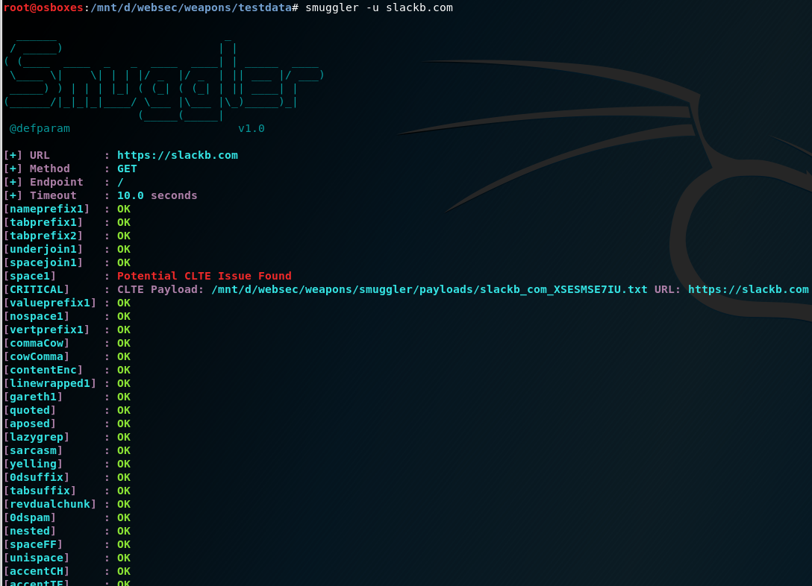
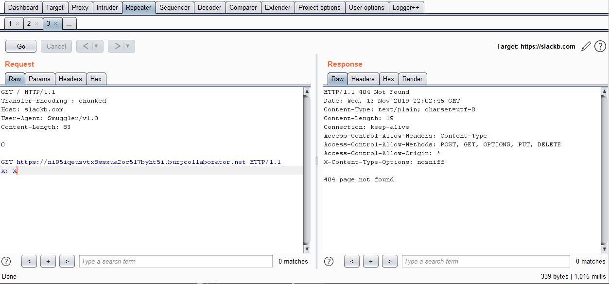
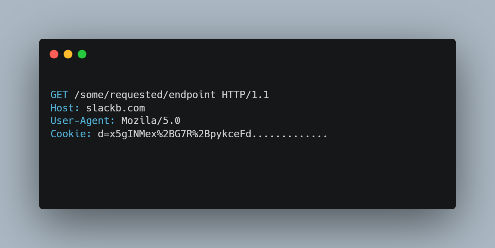
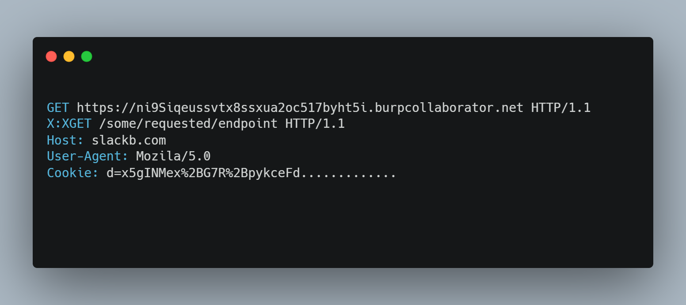
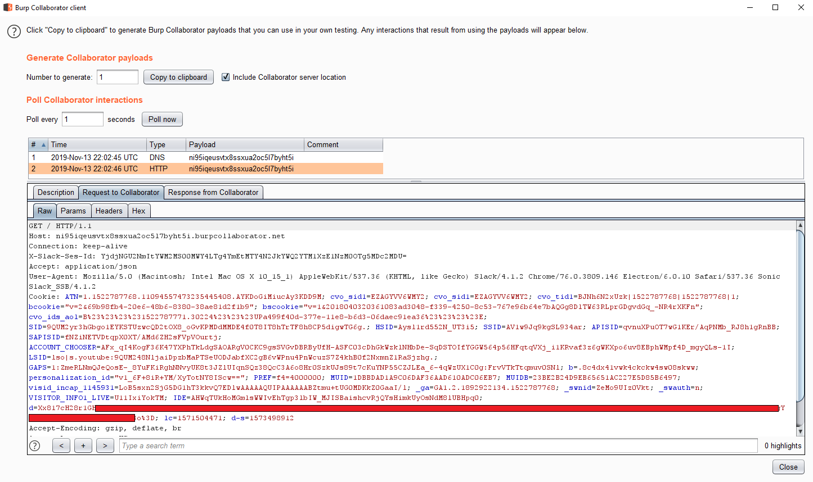
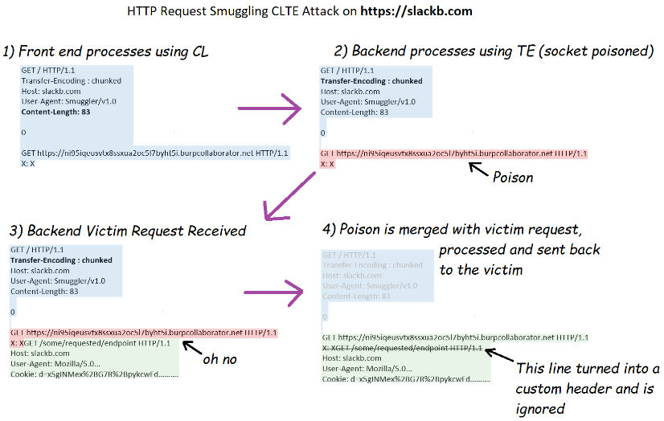

# Mass Account Takeovers using HTTP Request Smuggling 👻

### 1. Find Vulnerability🔍 
slackb.com was vulnerable to HTTP Request Smuggling. 
You can use [smuggler](https://github.com/defparam/smuggler) to find this vulnerability. 

 &nbsp;

### 2. Prepare Hook 🪝
Attacker exploited HTTP Request Smuggling bug to perform hijack onto neighboring user requests. 
Attacker send following request:

 &nbsp;

### 3. Victim Comes in 🚶🏻
Suppose victim send following request:

 &nbsp;

### 4. Weird Deal 🪄
victim's request will be appended to attacker's request and will turn into following request. 
This hijack forward victim onto attacker's server with slack domain cookies.

 &nbsp;

### 5. Attacker Becomes King 👑
User' secret session will be sent to attacker. 
With this attacker will be able to prove session takeover against arbitrary users. 
Slack reward $6500 for this bug.

 &nbsp;

### 6. Whole Attack Scenario 👁️

 &nbsp;

## Credit
Based on [defparam](https://hackerone.com/reports/737140)'s report.
 &nbsp;

## Support
You can Follow [me](https://twitter.com/MeAsHacker_HNA) on twitter or buy me a [Coffee](https://buymeacoffee.com/NafisiAslH)
