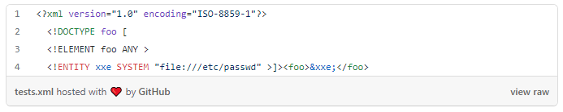
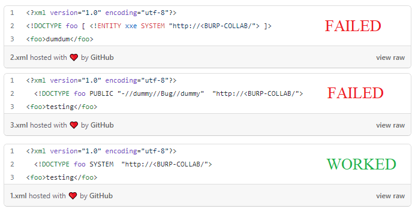
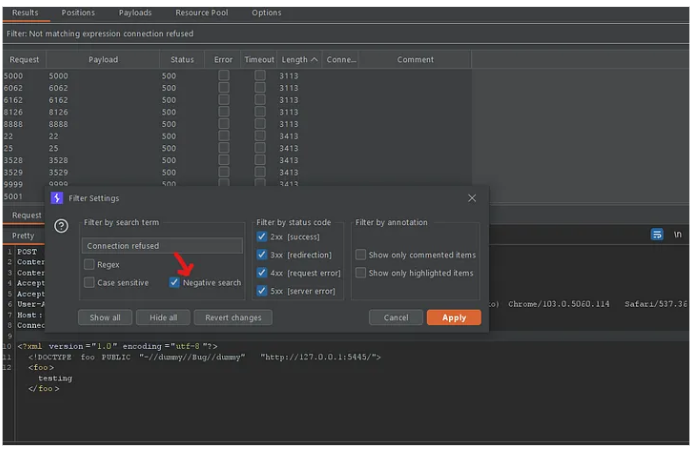
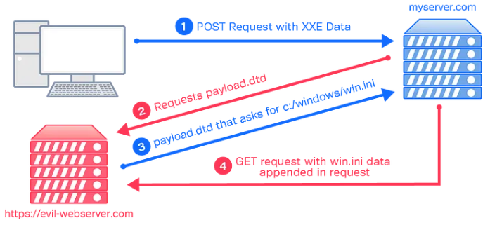
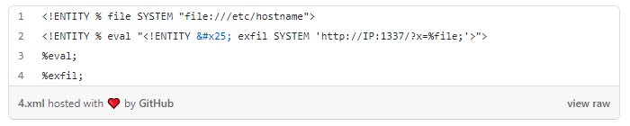
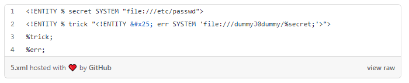

# Exploiting Out-of-Band XXE in the Wild from P4 to P1 🏆
 &nbsp;

### Phase 1 --> Recon 🧐
1. Collected list of IP from shodan 
2. Made full port scan with rustscan 
3. Came across IP with port 9180use some XML content 
4. I decided to test XXE 
 &nbsp;

### Phase 2 --> Analysis 🧩
1. I tried to retrieve local files, but i got nothing 
2. I used XXE payloads and started to compare with the responses differences, but I got nothing again. 
 
 &nbsp;

### Phase 3 --> SSRF (P4) 🍳
1. I tried to perform an HTTP request to my burp collab. 
2. So I tried several payloads until finally one of them worked. 
3. Bingoooooo! now I have P4 submission. 
 
 &nbsp;

### Phase 4 --> Port Scan (P3) 🍟
1. I thought what about escalating it to P3 with a simple port scanning? 
2. So I sent a simple request to 9180 and another to  1234 and compare the two responses 
3. So I made a simple port scan for top 10000 ports,  and I got some open ports :) 
 
 &nbsp;

### Phase 5 --> Limited OOB XXE (P2) 🍔
1. I thought it’s time to test Out-of-band XXE (picture) 
2. So we need a malicious DTD file that requests local files 
3. Our malicious DTD requests /etc/hostname file and send it to my IP on 1337 port 
4. And guess what?I  got the result. 
 
 

### Phase 6 --> final XXE (P1) 🏅
1. I made the OOB XXE exploitation successfully!! But actually, I couldn’t get any file with multiple lines 
2. I tried several techniques such as base64, FTP, ... but i failed in all of them. 
3. Finally I was able to do this with error messages 
 

## Credit
Based on [Mahmoud Youssef](https://0xmahmoudjo0.medium.com/exploiting-out-of-band-xxe-in-the-wild-16fc6dad9ee2)'s writeup.
 &nbsp;

## Support
You can Follow [me](https://twitter.com/MeAsHacker_HNA) on twitter or
  
